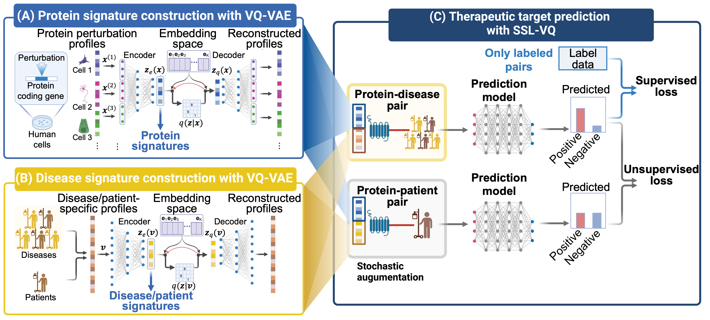

# Semi-supervised learning-based neural network with VQ-VAE signatures (SSL-VQ)

`SSL-VQ`  is a machine learning method for predicting therapeutic target molecules for various diseases, leveraging multimodal vector quzntized variation autoencoders (VQ-VAEs).




## Publication/Citation

The study of `SSL-VQ` is described in the manuscript [manuscript](URL). 

```
Satoko Namba, Chen Li, Noriko Otani and Yoshihiro Yamanishi. Vector-quantized variational autoencoders for semi-supervised prediction of therapeutic targets across diverse diseases 
```
<br>


## Installation

Just clone this repository.

```
cd ./SSL_VQ/
```

## Contents

- Protein signature construction with VQ-VAE: `./VAE/scr_VQ_VAE_target/`
- Disease signature construction with VQ-VAE: `./VAE/scr_VQ_VAE_disease/`
- Protein signature construction with VAE: `./VAE/scr_VAE_target/`
- Disease signature construction with VAE: `./VAE/scr_VAE_disease/`
- Therapeutic target prediction with SSL-VQ: `./PiModel/`
- Therapeutic target–disease association data of goldstandard set: `./semisupervised/data/`
- Therapeutic target–disease association data of uncharacterized disease set: `./semisupervised/data_old/`
- Requirements: `./env/requirements.txt`

## Requirements

The software is developed and tested in Mac OS environments.
To run SSL-VQ, you need to check the following libraries.

- `./env/requirements.txt`

## Usage

### Training SSL-VQ model and predicting novel therapeutic targets.

Go to the following directory.

```
$ cd ./PiModel/scr_train
```

If you want to train predictive model for inhibitory targets.

```
$ python3 ./01_Pi_NN_concat.py --fold_number=1 --pert_type=trt_sh.cgs --gene_hidden_sizes 1024 512 256 --gene_epochs=2000
```

If you want to train predictive model for activatory targets.

```
$ python3 ./01_Pi_NN_concat.py --fold_number=1 --pert_type=trt_oe --gene_hidden_sizes 1024 512 256 --gene_epochs=2000
```

The example command parameters mean:

- `--fold_number`: Cross validation fold number (e.g. 1, 2, ..., 5)
- `--pert_type`: Perturbation type of protein perturbation profiles (e.g. trt_sh.cgs or trt_oe)
- `--gene_hidden_sizes`: Hidden layer sizes of neural network (e.g. 1024 512 256)
- `--gene_epochs`: Neural network training epochs (e.g. 2000)


## Output files

- `saved_gene_nn.pkl`: Trained model
- `output.txt`: Prediction results
- `gene_nn_train_results.csv`: Log data of training process


## Contact

For any question, you can contact Yoshihiro Yamanishi ([yamanishi@i.nagoya-u.ac.jp](mailto:yamanishi@i.nagoya-u.ac.jp))
